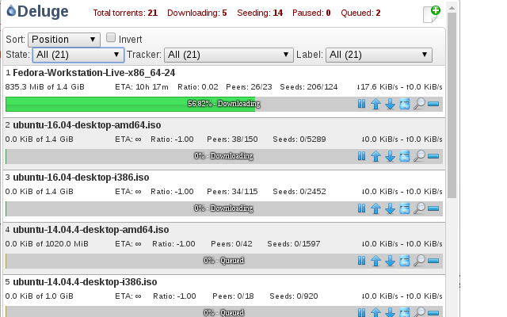

# Remote Deluge

Provides quick overview of torrent information in Chrome for the torrent client Deluge. This is not on Chrome Web Store because refuse me publish it even I chaange the icon, name and description. You can install it by loading unpacked (Linux/Mac) or whitelist it through domain policy (Windows).

## Request for help

I develop this in my spare time, which is very limited. Pull requests will be gratefully accepted where possible.

## Screenshot

## Version History
2017-10-20 v1.2.5
* Fix some bugs, change badge  text to finished count, move added message to notification.

2017-04-10 v1.2.4
* Fix for Deluge v1.3.14

2016-06-22 v1.2.3
* Fix bug for first-time users.

2016-06-22 v1.2.2
* Fix a couple niggling bugs and added a donate button. Please donate if you find my work useful! :)

2016-01-27 v1.2.1
* Fixed broken settings from v1.2.0

2016-01-26 v1.2.0
* Fix context menu
* Fixed possible connections issue
* Various other code improvements

2015-06-04 v1.1.0
* Fix for connectivity problem introduced in last version

2015-06-03 v1.0.0
+ Add an option to settings for a base path for reverse-proxied connections.
